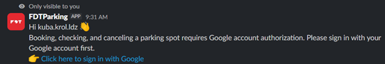
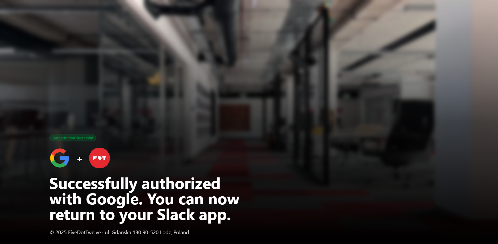
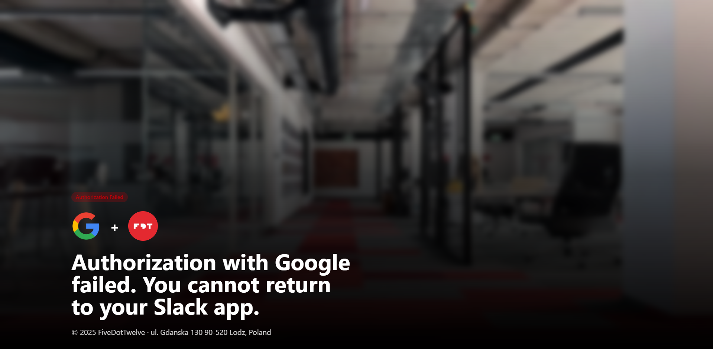
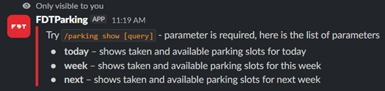

  

⭐ Below you will find a list of available commands, along with explanations of how they work and what responses they return. 🚀✨

---

## /parking help

Displays a list of all available commands with short descriptions (visible only to you).

  

## /parking login

You must log in to access the show, reserve, and cancel commands. Use the login command first (visible only to you). 

Not logged in

  

Logged in

  

Here are the results after Google authorization

Successful Authorization

  

Failed Authorization

  

After successful or unsuccessful authorization, the bot sends a private message to the user. 

  

## /parking reserve

This command reserves parking slots. A modal window opens after executing the command.

  

Users can select parking slots only from a predefined list.

- FDT Parking 7
- FDT Parking 8
- FDT Parking 9
- FDT Parking MOL

The modal window includes basic validations. Here are some examples:

-	Please complete this required field.
- Parking spot FDT Parking 7 is already booked for 2025-09-18.
- You can't reserve a parking spot in the past.

After a successful or unsuccessful reservation, the bot sends a private message to the user.

- You have successfully reserved parking spot FDT Parking 9 for 2025-09-19.
- Failed to reserved for parking spot FDT Parking 9 for 2025-09-19. Please try again.

## /parking cancel

This command cancels a reserved parking slot. A modal window opens after executing the command.

  

Only reservations booked by the user are available.

  

The modal window includes basic validation. Here are some examples:

- Please complete this required field.

After a successful or unsuccessful cancellation, the bot sends a private message to the user.

- You have canceled your reservation for parking spot FDT Parking 9 on 2025-09-19.
- Failed to cancel your reservation for parking spot FDT Parking 9 on 2025-09-19. Please try again.

## /parking show

Shows which parking slots are taken and available based on the selected time period. [query] must be provided.

  

Results for the selected parameter will display a table with taken and available parking slots

Today

  

Week

  

Past dates are automatically marked as unavailable.
Next

  

